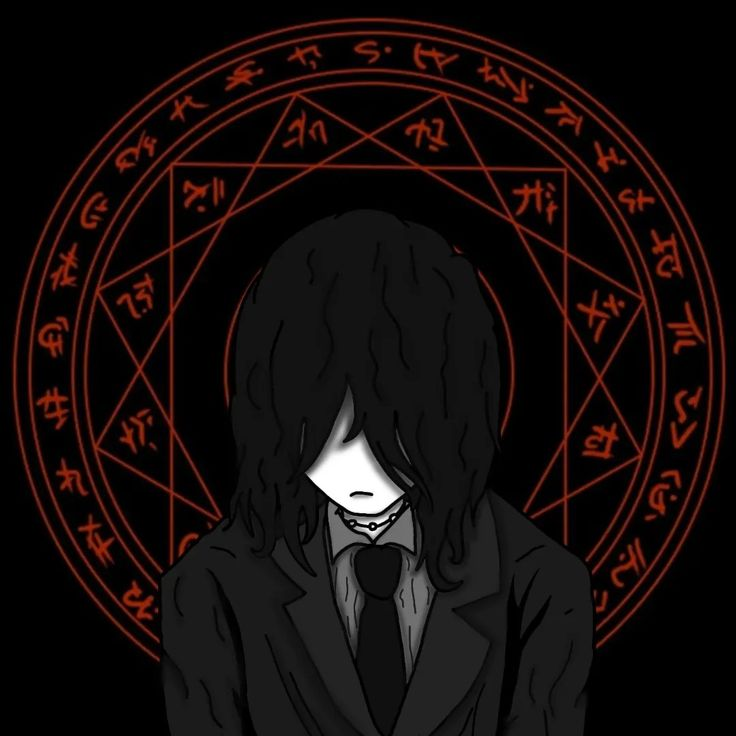

# Rayf

### Reverse Engineering • Programming • Web Development

 

  

---

## About

I'm Rayef, an 18-year-old chemistry student who also happens to spend a lot of my free time programming.

Programming started as a side hobby for me, but I became especially interested in understanding how software works internally rather than only using it.

Most of my interests are around reverse engineering, malware analysis, OSINT, and web development.

I'm also a co-owner of **DeadlySins**.

---

## Focus

<table>
<tr>
<td align="center" width="25%">

### 🧩

**Reverse Engineering**

</td>
<td align="center" width="25%">

### 🦠

**Malware Analysis**

</td>
<td align="center" width="25%">

### 🔎

**OSINT**

</td>
<td align="center" width="25%">

### 🌐

**Web Development**

</td>
</tr>
</table>

---

## Languages

---

## Tools

---

## Currently Learning

`C++`   `Reverse Engineering`   `Cybersecurity`

 

`Malware Analysis`   `Systems`   `Networking`

---

## Activity

<picture>
  <source media="(prefers-color-scheme: dark)" srcset="https://raw.githubusercontent.com/biwncedevins/biwncedevins/output/github-snake-dark.svg">
  
</picture>

---

